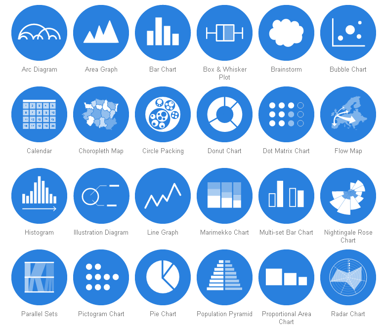
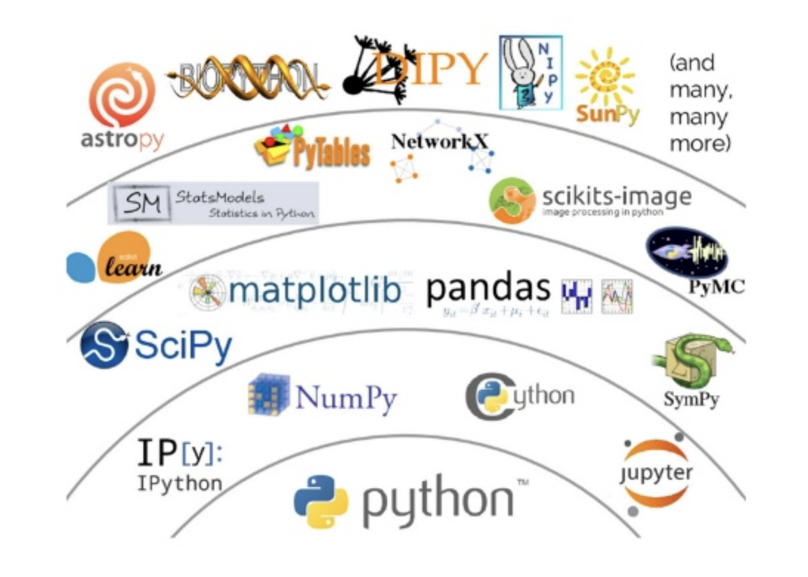

# Day 1 : Introduction to Data Science and Python

Day 1 of the skills course in Data Science provides a quick introduction to data science domain and different analytics roles that students may start thinking about for career development. This lesson provides an introduction to Python as a language of choice and compares it with other maintstream platforms used for data analysis. For the pracrical part, the lesson introducdes some basic data types and operators in Python and methods to manipulate them. The lesson also provides an introduction to data I/O along with student centred simple coding exercises in Python. 

## SWBATS: 

* Describe the data science process with a clear understanding of stages involved 
* Understand different roles within data analytics domain with required skillsets
* Compare different programming paradigms for data science and provide a rational for using Python
* Define basic data types in Python and perform operations on these data types
* Declare and assign values to variables
* Running a simple program with user prompted data input and output

## Lesson 1 (part1)  -   40 - 45 minutes.

###  Learning Objectives

* The "Data Science Process" 
* Different Roles in the data analytics domain

## Overview

This lesson provides an introduction to the data science process and challenges generally faced by data scientists at different stages of this process. Students will also be introduced to different roles within data science domain with a focus on similarities and differences between these roles. This would allow students to better position themselves for a role that suits their skills and aspirations. 

## The Data Science Process 

A common question asked by most aspiring data scientists is "How to do data science ?" or "How do I get started with data science skills". Following steps describe different stages of the data science process as shown by Sudeep Agarwal [Understanding Data Science Life Cycle](http://sudeep.co/data-science/Understanding-the-Data-Science-Lifecycle)

#### Business Understanding / Domain Knowledge

Before trying to solve a data related problem, it is imperative that a data scientist/analyst carries a clear understanding of the problem domain. Following 5 types of analytical questions are generally asked at this stage as stated in [Microsoft Azure blog]
(https://docs.microsoft.com/en-us/azure/machine-learning/team-data-science-process/lifecycle-business-understanding) 

* **How much or how many?** 
e.g. Identifying number of new customers likely to join your company in next quarter. (Regression analysis)

* **Which category?**
e.g. Assigning a document to a given category for a document management system.  (Classification analysis)

* **Which group?**
e.g. Creating a number of a groups (segments) of your customers based on their monetary value. (Clustering)

* **Is this weird?**
e.g. Detecting suspicious activities of a customers by a credit card company to identify potential fraud. (Anomaly detection)

* **Which option should be taken?**
e.g. Recommending new products (e.g. movies/books/music by Amazon) to exisating customers (Recommendation systems)

> Exercise: Think of at at least one such analytical question. Determine which of above category does your question belong to and how answering it correctly may help you achieve your analysis goal.

#### Data Collection

After asking the analytical question and identifying objectives for your analysis, the next stage of analysis is to identify and gather the required data. Data mining is a process of identifying and collecting data of interest from different sources e.g. databases, text files, Internet and also printed documents etc. Some of the questions that you may ask yourself at this stage are:

* What data items do I need in order to answer my analytical question ?
* Where can I find this data ?
* How can I obtain the data from data source ?
* How do I sample from this data ?
* are their any privacy/ legal issues that I must consider prior to data usage ?

#### Data Cleaning 

Data cleaning/cleansing/preprocessing/wrangling is usually the most time consuming stage within the data science process,  specially in the Big data domain. This stage may take upto 50-80% of a data scientist's time as there are a vast number of possible problems that make the data "dirty" and unsuitable for analysis. Some of the problems you may see in data are follows:

* Inconsistencies in data 
* Mis-spelled text data
* Outliers 
* Imbalanced data 
* Invalid/outdated data 
* Missing data 

Data cleaning stage require development of a strategy on how to deal with these issues. Such a strategy may highly vary between different analysis experiments according to the nature of analytical question.

#### Data Exploration 

Data exploration or *Exploratory Data Analysis* is the stage that follows data cleaning. Exploratory analysis help highlight the patterns, relations, variance and bias of available data. Exploratory analysis may involve following activities:

* Selecting a subset of a bigger dataset for exploration
* Calculating basic statistics i.e. mean, median and mode etc. 
* Plotting histograms, scatter plots, distribution curves to identify trends in data
* Other interactive visualisation with filtering to focus on a specific segment of data

#### Feature Engineering

A "Feature" is a measurable attribute of phenomenon being observed. Based on the nature of analystical question asked in the first step, a data scientist may have to engineer additional features not found in the original dataset. Feature engineering is the process of using expert knowledge to transform raw data into meaningful features that directly address the problem you are trying to solve i.e. creating a BMI (Body Mass Index) from the weights and heights of individuals in the dataset. This stage will directly influence the accuracy of the predictive model you construct in the next stage.

#### Predictive Modelling 

Modelling is the stage where you use mathematical and/or statistical approaches are used to answer your analytical question. Predictive Modelling refers to the process of using probabalistic statistical methods to "Predict" the outcome of an event e.g. based on employee  data, an organisation can develop a predictive model to identify employee attrition rate in order to develop better retention strategies.Chossing the right model could be a challenging decision as there is never a single right answer. Selecting a model involves balancing the performance and computational cost of the analysis process. Some recent approaches in predictive modelling e.g. deep learning, have been shown to offer vastly improved accuracy of results, but with a very high computational cost. 

 **Ask students to provide more predictive analysis examples"** 

Modelling also involves evaluation of the results to identify the level of confidence that a data scientist can have on the outcome. There are a number of such evaluation techniques that can be used i.e. for PCC (percent correct classification), confusion matrix, ROC curves, MSE (Mean squared error) etc.

#### Data Visualisation 

Data Visualisation is a multidisciplinary domain in itself and borrows ideas from communication theory, psychology, statistics After deriving the required results from a statistical model, visualisations are normally used to summarise and present the findings of analysis process in a form which is easily understandable by non-technical decision makers. Data visualisation could be thought of as an evolution of visual communication techniques as it deals with "VISUAL" representation of data. A number of different data visualisation techniques ranging from bar graphs, line graphs, scatter plots to alluvial diagrams, spatio-temporal visualisations etc. 

## Data Science Roles (20 min including exercise)

The data analystics field offers a number of different roles which may expect slightly different skillsets with some overlap. Following illustrations by [Martin Theuwissen](https://www.kdnuggets.com/author/martijn-theuwissen) describe these different roles in an interesting manner.  

#### Data Scientist 

A data scientist masters a whole range of skills and talents going from being able to handle the raw data, analyzing that data with the help of statists, modelling for predictive analysis to sharing insights with his peers in a compelling way using visualisations.

#### Data Analyst 

Data Analyst carries a diverse skill set ranging from coding, data collection, statistics and communications skills. There is some overlap between the skills expected from data scientists and analysts as shown along side their personas. 

#### Data Architect

The data architect is responible for design and development of data management systems which combine, centralize, secure and maintain the data sources. With the rise of big data, the demand for data architects is rapidly increasing. 

#### Data Engineer

A data engineer is required to have expertise in software engineering with indepth knowledge of design and build type projects. A data engineer having a breadth of knowledge on different technologies and development platforms can easily adapt to new systems and processes. 

#### Statistician 

The primary responsibility of a statistician is getting useful insights from the data. In other words, a statistican turns data into information and knowledge which helps towards managerial decision making. A statistician's quantitative background helps greatly towards learning new platforms and technologies for data analysis. 

#### Database Administrator (DBA)

Data is being the "New Gold". A DBA ensures the avilability, integrity and security of data. DBA also makes sure that data backup and recovery processes are well defined and are in place. DBA would normally be expected to know the state of the art data management technologies. 

#### Business Analyst

A business analyst is not required to have in-depth knowledge of analytics related tools and technologies, instead he/she is required to have knowledge and experience of the processes related to problem domain. A Business analyst converts data insights into business insights and is also responsible for organisation-wide dissemination of these insights. You can think of a business analyst as a bridge between technical staff and operational staff. 

> Exercise: Take 5 minutes to think about different data science roles shown above. In your opinion, which of these roles suits your aspirations and skills. Also think about the skills required by your dream role that you may not currently have. Discuss in pairs. Share your ideas with the instructor. 

## Lesson 1 (part 2) 2 hours. 

### Topics

* Data Science Tools and Technologies
* Python Programming Language and rationale for adoption
* Basic data types (Strings, Numbers and Boolean) with coding exercises
* Python variable declaration, assignment and re-assignment with coding exercises
* Python user I/O with coding exercises

Each coding exercise should be explained in about 10 minutes and another 20 minutes for students to try out the code.  provides a brief introduction to some of the programming environments used for data analysis including MATLAB, R and Python. Students will be provided with a rationale behind choosing python as a language of choice for data science experiments. This lesson then links to the coding exercises which have been developed by data science team at Flatiron to introduce basic programming concepts in Python including variable declaration and assignment, string and numercial data types and summing it all up with the song analysis experiment. 

**Provide a comparison of major programming environments**, consult [Quora](https://www.quora.com/Between-R-MATLAB-and-Python-which-one-is-better-for-artificial-intelligence-data-science-and-research) and This excellent review [paper](https://www.google.com/url?sa=t&rct=j&q=&esrc=s&source=web&cd=2&ved=0ahUKEwior87c-p3bAhUHIsAKHcUiAIwQFggzMAE&url=http%3A%2F%2Fwww.jds-online.com%2Ffile_download%2F612%2F150%25E5%25AE%258C%25E6%2588%2590V.pdf&usg=AOvVaw3Kzd_dYVl66naduCjZr0HR) )

* Python is a general purpose language that is easy and intuitive whereas finding packages in R can take a lot time if you are not familiar with it. In short, if you have less time to code Python would be a better option.

* R has a rich ecosystem of cutting-edge packages and active community. CRAN (Comprehensive R Archive Network) is a huge R repository of R packages which is comparatively huge than PyPi(Python Package Index) 

* R is more useful when the data analysis requires an individual server whereas Python is more useful when analysis is distributed and has to be incorporated into other apps.

* Python is a good tool to implement algorithms as it is a fully fledged programming language whereas R is preferable when statistical models have to be developed.

* Python is also used in Embedded Systems whereas R is moreover restricted to developing Statistical model to visualize data sets.

* R is comparatively slow, as it has so many open source packages(greater than Python).

* MATLAB uses proprietary algorithms, popular for Digital Signal & Image Processing in academic/research community. 

* Mathworks(Matlab) puts restrictions on code portability, the ability to run your code on someone elses computer. You can run your “compiled” application using the Matlab Component Runtime (MCR), but your portbale app must exactly match the version of the installed MCR, which can be a nuisance considering that Matlab releases a new version every 6 months.

* Matlab is quite expensive, which means that code that is written in Matlab can only be used by people with sufficient funds to buy a license.

*  Matlab might be easier for beginners, because the packages have nearly everything you need, while in Python you need to install extra packages and an IDE. It has a large scientific community; it is used on many universities.

## Python (Introduction 15 mins)

**Provide a rationale for choosing Python over other languages** 

Python is a general purpose programming language which is heavily being used by data scientists alongside R and MATLAB. Python is generally preferred as a tool of choice for data analysis for following reasons:

* Python is open source which reduces the cost of analysis as compared to proprietary solutions like MATLAB 
* Python has a massive online community 
* Comparatively easier to learn and program due to high level abstractions
* Python can handle different types of data ranging from structured data  e.g. relational databases, NoSQL, csv, Jason, XML to unstructured data e.g. images, video and text
* Python has many package as suitable for simpler Analytics projects (eg. segmentation, cohort analysis, explorative analytics, etc.) as advanced Data Science projects (eg. building machine learning models)
* The industry is keen to hire data professionals with solid Python knowledge. It means knowing Python will be an extremely competitive element in your career development
* Python is applicable to the complete data science process from data collection, pre-processing to predictive modelling and visualisations. 

(Provide examples of some of the data analysis specific libraries in Python)

You dont have to learn every functional offering by Python for data analysis. A basic understanding of datatypes offered by Python along with a clear understanding of Python syntax can allow you to start getting engaged into basic data analysis experiments. For advanced analysis, Python packages including SciPy, NumPy, Pandas, ScikitLearn and TensorFlow are popular choices for machine learning and deep learning experiments. 

## Python Basics (30 minutes for each exercise, including 10-15 minutes explanation for each exercise)

Following section requires you to go through a number of practical exercises which would help you understand basic progaramming concepts in Python. 

* [Demo: Instant Data Science](https://github.com/learn-co-curriculum/python-intro-to-strings)

* [Lesson: Handling Text with "String" datatype](https://github.com/learn-co-curriculum/python-intro-to-strings)

* [Lesson: Dealing with numbers in Python](https://github.com/learn-co-curriculum/python-numbers-and-booleans)

* [Lab: Handling datatypes](https://github.com/learn-co-curriculum/python-practice-with-datatypes)

* [Lesson: Declaring and Assigning Variables](https://github.com/learn-co-curriculum/python-variables-readme)

* [Lab: Dealing with variables in Python](https://github.com/learn-co-curriculum/python-variables-lab)

* [User Input and Output](labs/IO.ipynb)
 
 
 ## Conclusion and Summary
 
In today's class, we looked at the data science lifecycle and different activities that data scientists engage themselves into while doing data analysis. We also looked at different roles within the data science domain and how these compare and contrast  with each other. This would have given you a basic ideas around the data science domain and now you can start thinking and planning around achieving these skills. 

We also tried a number of coding exercises to understand Python basic data types including numbers, strings and boolean with operations suitable for specific data types. We also looked at variable declaration/assignment in Python. Handling user I/O to get and print data for users 

Further Readings: 

* [The Data Science Process: What a data scientist actually does day-to-day](https://medium.springboard.com/the-data-science-process-the-complete-laymans-guide-to-what-a-data-scientist-actually-does-ca3e166b7c67)

* [4 Types of Data Science jobs](https://blog.udacity.com/2018/01/4-types-data-science-jobs.html)
* [Python vs. R vs. Matlab @ResearchGate](https://www.researchgate.net/profile/Ceyhun_Ozgur/publication/301970357_Matlab_vs_Python_vs_R/links/572d054a08aeb1c73d11b6fe/Matlab-vs-Python-vs-R) 

* [A Simpler version of Data Science Process](https://cdn.slidemodel.com/wp-content/uploads/7309-01-data-science-powerpointp-template-16x9-04-870x489.jpg) or 
* [Another simpler version of Data Science Process](http://54.159.122.118/wp-content/uploads/2016/06/1_Activities_D.png). 
