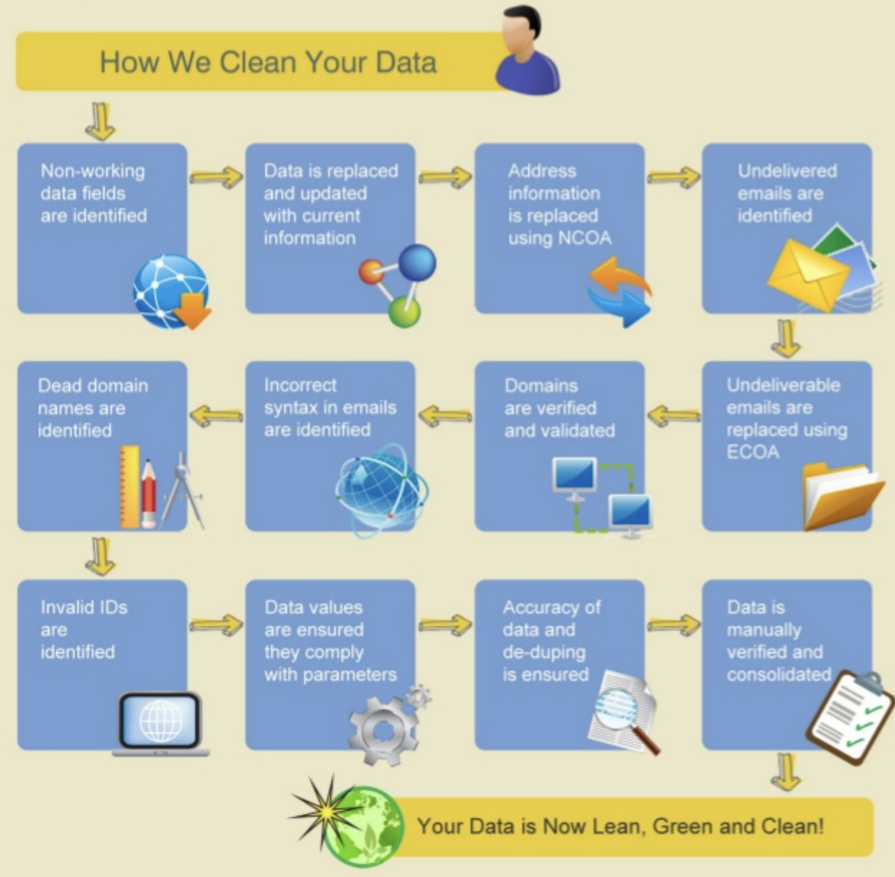
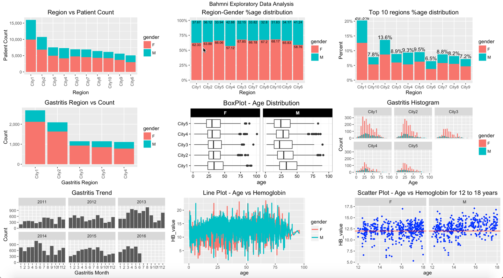
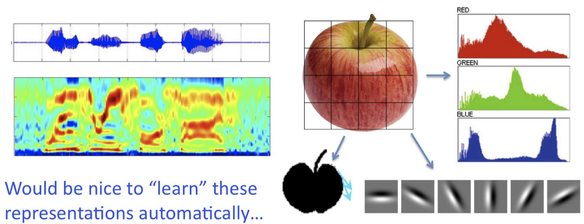
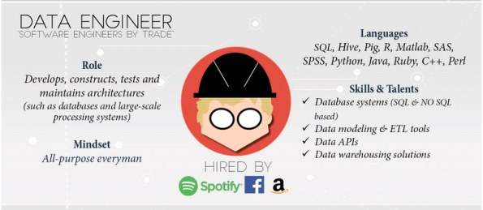
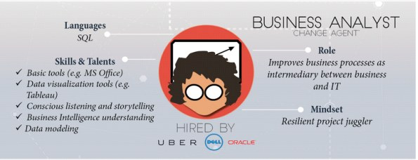

## Overview

This lesson provides an introduction to the data science process and challenges generally faced by data scientists at different stages of this process. Students will also be introduced to different roles within data science domain with a focus on similarities and differences between these roles. This would allow students to better position themselves for a role that suits their skills and aspirations. 

 

## The Data Science Process (20-25 min, explanations = 15 min, exercise = 5-10 min)

A common question asked by most aspiring data scientists is "How to do data science ?" or "How do I get started with data science skills". Following steps describe different stages of the data science process as shown by Sudeep Agarwal [Understanding Data Science Life Cycle](http://sudeep.co/data-science/Understanding-the-Data-Science-Lifecycle)

#### Business Understanding / Domain Knowledge

Before trying to solve a data related problem, it is imperative that a data scientist/analyst carries a clear understanding of the problem domain. Following 5 types of analytical questions are generally asked at this stage as stated in [Microsoft Azure blog]
(https://docs.microsoft.com/en-us/azure/machine-learning/team-data-science-process/lifecycle-business-understanding) 

* **How much or how many?** 
e.g. Identifying number of new customers likely to join your company in next quarter. (Regression analysis)

* **Which category?**
e.g. Assigning a document to a given category for a document management system.  (Classification analysis)

* **Which group?**
e.g. Creating a number of a groups (segments) of your customers based on their monetary value. (Clustering)

* **Is this weird?**
e.g. Detecting suspicious activities of a customers by a credit card company to identify potential fraud. (Anomaly detection)

* **Which option should be taken?**
e.g. Recommending new products (e.g. movies/books/music by Amazon) to exisating customers (Recommendation systems)
> Exercise: Think of at at least one such analytical question. Determine which of above category does your question belong to and how answering it correctly may help you achieve your analysis goal.

#### Data Collection

After asking the analytical question and identifying objectives for your analysis, the next stage of analysis is to identify and gather the required data. Data mining is a process of identifying and collecting data of interest from different sources e.g. databases, text files, Internet and also printed documents etc. Some of the questions that you may ask yourself at this stage are:

* What data items do I need in order to answer my analytical question ?
* Where can I find this data ?
* How can I obtain the data from data source ?
* How do I sample from this data ?
* are their any privacy/ legal issues that I must consider prior to data usage ?

#### Data Cleaning 

Data cleaning/cleansing/preprocessing/wrangling is usually the most time consuming stage within the data science process,  specially in the Big data domain. This stage may take upto 50-80% of a data scientist's time as there are a vast number of possible problems that make the data "dirty" and unsuitable for analysis. Some of the problems you may see in data are follows:

* Inconsistencies in data 
* Mis-spelled text data
* Outliers 
* Imbalanced data 
* Invalid/outdated data 
* Missing data 

Data cleaning stage require development of a strategy on how to deal with these issues. Such a strategy may highly vary between different analysis experiments according to the nature of analytical question.

#### Data Exploration 

Data exploration or *Exploratory Data Analysis* is the stage that follows data cleaning. Exploratory analysis help highlight the patterns, relations, variance and bias of available data. Exploratory analysis may involve following activities:

* Selecting a subset of a bigger dataset for exploration
* Calculating basic statistics i.e. mean, median and mode etc. 
* Plotting histograms, scatter plots, distribution curves to identify trends in data
* Other interactive visualisation with filtering to focus on a specific segment of data

#### Feature Engineering

A "Feature" is a measurable attribute of phenomenon being observed. Based on the nature of analystical question asked in the first step, a data scientist may have to engineer additional features not found in the original dataset. Feature engineering is the process of using expert knowledge to transform raw data into meaningful features that directly address the problem you are trying to solve i.e. creating a BMI (Body Mass Index) from the weights and heights of individuals in the dataset. This stage will directly influence the accuracy of the predictive model you construct in the next stage.

#### Predictive Modelling 

Modelling is the stage where you use mathematical and/or statistical approaches are used to answer your analytical question. Predictive Modelling refers to the process of using probabalistic statistical methods to "Predict" the outcome of an event e.g. based on employee  data, an organisation can develop a predictive model to identify employee attrition rate in order to develop better retention strategies.Chossing the right model could be a challenging decision as there is never a single right answer. Selecting a model involves balancing the performance and computational cost of the analysis process. Some recent approaches in predictive modelling e.g. deep learning, have been shown to offer vastly improved accuracy of results, but with a very high computational cost. 

 **Ask students to provide more predictive analysis examples"** 

Modelling also involves evaluation of the results to identify the level of confidence that a data scientist can have on the outcome. There are a number of such evaluation techniques that can be used i.e. for PCC (percent correct classification), confusion matrix, ROC curves, MSE (Mean squared error) etc.

#### Data Visualisation 

Data Visualisation is a multidisciplinary domain in itself and borrows ideas from communication theory, psychology, statistics After deriving the required results from a statistical model, visualisations are normally used to summarise and present the findings of analysis process in a form which is easily understandable by non-technical decision makers. Data visualisation could be thought of as an evolution of visual communication techniques as it deals with "VISUAL" representation of data. A number of different data visualisation techniques ranging from bar graphs, line graphs, scatter plots to alluvial diagrams, spatio-temporal visualisations etc. 

## Data Science Roles (20 min including exercise)

The data analystics field offers a number of different roles which may expect slightly different skillsets with some overlap. Following illustrations by [Martin Theuwissen](https://www.kdnuggets.com/author/martijn-theuwissen) describe these different roles in an interesting manner.  

#### Data Scientist 

A data scientist masters a whole range of skills and talents going from being able to handle the raw data, analyzing that data with the help of statists, modelling for predictive analysis to sharing insights with his peers in a compelling way using visualisations.

#### Data Analyst 

Data Analyst carries a diverse skill set ranging from coding, data collection, statistics and communications skills. There is some overlap between the skills expected from data scientists and analysts as shown along side their personas. 

#### Data Architect

The data architect is responible for design and development of data management systems which combine, centralize, secure and maintain the data sources. With the rise of big data, the demand for data architects is rapidly increasing. 

#### Data Engineer

A data engineer is required to have expertise in software engineering with indepth knowledge of design and build type projects. A data engineer having a breadth of knowledge on different technologies and development platforms can easily adapt to new systems and processes. 

#### Statistician 

The primary responsibility of a statistician is getting useful insights from the data. In other words, a statistican turns data into information and knowledge which helps towards managerial decision making. A statistician's quantitative background helps greatly towards learning new platforms and technologies for data analysis. 

#### Database Administrator (DBA)

Data is being the "New Gold". A DBA ensures the avilability, integrity and security of data. DBA also makes sure that data backup and recovery processes are well defined and are in place. DBA would normally be expected to know the state of the art data management technologies. 

#### Business Analyst

A business analyst is not required to have in-depth knowledge of analytics related tools and technologies, instead he/she is required to have knowledge and experience of the processes related to problem domain. A Business analyst converts data insights into business insights and is also responsible for organisation-wide dissemination of these insights. You can think of a business analyst as a bridge between technical staff and operational staff. 

> Exercise: Take 5 minutes to think about different data science roles shown above. In your opinion, which of these roles suits your aspirations and skills. Also think about the skills required by your dream role that you may not currently have. Discuss in pairs. Share your ideas with the instructor. 

